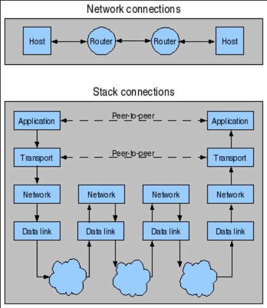
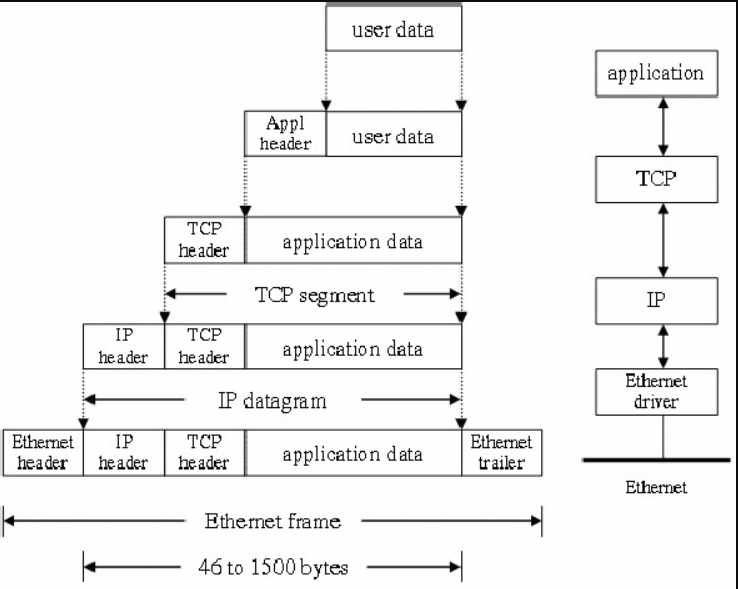
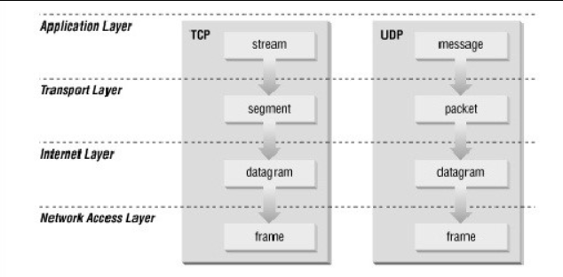

## **Giới thiệu tổng quan về bộ giao thức TCP/IP**
1. **Tổng quan:**  TCP/IP là bộ giao thức cho phép kết nối các hệ thống mạng không đồng nhất với nhau. Ngày nay TCP/IP được sử dụng rộng rãi trong mạng cục bộ cũng như mạng toàn cầu. TCP/IP được xem như giản lược của mô hình tham chiếu OSI với 4 tầng như sau: o Tầng Liên Kết (Datalink Layer) o Tầng Mạng (Internet Layer) o Tầng Giao Vận (Transport Layer) o Tầng Ứng Dụng (Application Layer).

*Các tầng trong Bộ giao thức TCP/IP.*
***
- **Tầng liên kết:**  là tầng thấp nhất trong mô hình TCP/IP, bao gồm các thiết bị giao tiếp mạng và các chương trình cung cấp các thông tin cần thiết để có thể hoạt động, truy nhập đường truyền vật lý qua các thiết bị giao tiếp mạng đó.
- **Tầng Internet:** Tầng Internet ( hay còn gọi là tầng Mạng) xử lý quá trình truyền gói tin trên mạng, các giao thức của tầng này bao gồm : IP ( Internet Protocol) , ICMP ( Internet Control Message Protocol) , IGMP ( Internet Group Message Protocol ).
- **Tầng giao vận:** Tầng giao vận phụ trách luồng dữ liệu giữa 2 trạm thực hiện các ứng dụng của tầng trên, tầng này có 2 giao thức chính là TCP ( Transmisson Control Protocol) và UDP ( User Datagram Protocol ) - TCP cung cấp luồng dữ liệu tin cậy giữa 2 trạm, nó sử dụng các cơ chế như chia nhỏ các gói tin ở tầng trên thành các gói tin có kích thước thích hợp cho tầng mạng bên dưới, báo nhận gói tin, đặt hạn chế thời gian timeout để đảm bảo bên nhân biết được các gói tin đã gửi đi. Do tầng này đảm bảo tính tin cậy nên tầng trên sẽ không cần quan tâm đến nữa - UDP cung cấp một dịch vụ rất đơn giản hơn cho tầng ứng dụng . Nó chỉ gửi dữ liệu từ trạm này tới trạm kia mà không đảm bảo các gói tin đến được tới đích. Các cơ chế đảm bảo độ tin cậy được thực hiện bởi tầng trên Tầng ứng dụng.
- **Tầng ứng dụng:** là tầng trên của mô hình TCP/IP bao gồm các tiến trình và các ứng dụng cung cấp cho người sử dụng để truy cập mạng. Có rất nhiều ứng dụng được cung cấp trong tầng này , mà phổ biến là Telnet: sử dụng trong việc truy cập mạng từ xa, FTP ( File Transport Protocol ) dịch vụ truyền tệp tin., EMAIL : dịch vụ truyền thư tín điện tử. WWW ( Word Wide Web ).

2. **Phương thức hoạt động của bộ giao thức TCP/IP**

Quá trình đóng mở gói dữ liệu trong TCP/IP
***
Cũng tương tự như trong mô hình OSI, khi truyền dữ liệu , quá trình tiến hành từ tầng trên xuống tầng dưới, qua mỗi tầng dữ liệu được them vào thông tin điều khiển gọi là Header. Khi nhận dữ liệu thì quá trình xảy ra ngược lại. dữ liệu được truyền từ tấng dưới lên và qua mỗi tầng thì phần header tương ứng sẽ được lấy đi và khi đến tầng trên cùng thì dữ liệu không còn phần header nữa.

 

Cấu trúc dữ liệu trong TCP/IP
***
Trong hình ta thấy tại các tầng khác nhau dữ liệu được mang những thuật ngữ khác nhau o Trong tầng ứng dụng: dữ liệu là các luồng được gọi là stream. o Trong tầng giao vận: đơn vị dữ liệu mà TCP gửi xuống gọi là TCP segment. o Trong tầng mạng, dữ liệu mà IP gửi xuống tầng dưới gọi là IP Datagram o Trong tầng liên kết, dữ liệu được truyền đi gọi là frame.
***
Link tài liệu [https://vnpro.vn/tin-tuc/gioi-thieu-tong-quan-ve-bogiao-thuc-tcpip-1103.html].
